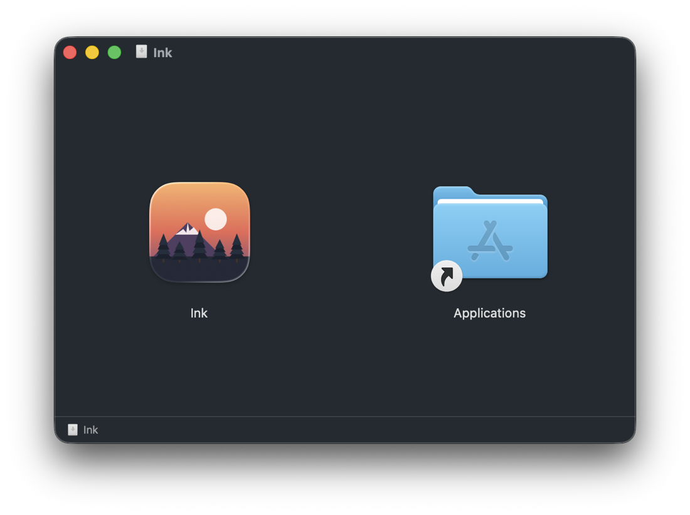

# Ink

An infinite-canvas drawing board for macOS. Vector strokes, a camera you pan
and zoom instead of a canvas that ends, screenshot annotation, and Markdown /
LaTeX cards rendered right onto the board.

### ▶︎ [Try it in your browser — guebin.github.io/ink](https://guebin.github.io/ink/)

No install, no sign-in — the same board as the app, for drawing and exporting
a PNG. Keeping boards as `.ink` files is the app's job.

## Install (macOS)

The build is ad-hoc signed — there is no Apple Developer certificate behind it
— so macOS blocks it after a plain download. Pick whichever route suits you.

### 1. Homebrew

Open **Terminal** and run:

```bash
brew tap guebin/ink https://github.com/guebin/ink
brew trust guebin/ink          # personal taps ask for this once
brew install --cask ink
```

Ink lands in `/Applications` like any other app (Launchpad, Spotlight, Dock)
and opens straight away. Update later with `brew upgrade --cask ink`.

No Homebrew on your Mac? Route 2 needs nothing installed first.

### 2. One command, without Homebrew

Open **Terminal** and paste all six lines at once — they run as one command
that downloads, installs and opens Ink:

```bash
curl -sL https://github.com/guebin/ink/releases/latest/download/Ink.dmg -o /tmp/Ink.dmg &&
hdiutil attach /tmp/Ink.dmg -nobrowse -quiet -mountpoint /tmp/InkVol &&
ditto /tmp/InkVol/Ink.app /Applications/Ink.app &&
hdiutil detach /tmp/InkVol -quiet &&
xattr -dr com.apple.quarantine /Applications/Ink.app &&
open /Applications/Ink.app
```

### 3. By hand

[Download Ink.dmg](https://github.com/guebin/ink/releases/latest/download/Ink.dmg)
and drop **Ink** onto **Applications**:



macOS will refuse to open it — press **Done**, never **Move to Trash** (that
empties the app bundle). Then open **Terminal** and run this once:

```bash
xattr -dr com.apple.quarantine /Applications/Ink.app
```

Requires macOS 12 or later. Nothing to install at all: the
[web version](https://guebin.github.io/ink/) is the same board.

## Uninstall

There are only two, since **2** and **3** both just place the app in
`/Applications` by hand.

### If you used 1 (Homebrew)

Open **Terminal** and run:

```bash
brew uninstall --cask ink      # removes /Applications/Ink.app
brew untap guebin/ink          # optional: forget the tap as well
```

Use `brew uninstall --zap --cask ink` to drop Ink's settings at the same time.

### If you used 2 or 3

Drag `Ink.app` from **Applications** to the Trash, or:

```bash
rm -rf /Applications/Ink.app
```

Either way your boards are safe — `.ink` files stay wherever you saved them.
To clear the app's leftovers too:

```bash
rm -rf ~/Library/Preferences/com.cgb.ink.plist \
       ~/Library/"Saved Application State"/com.cgb.ink.savedState \
       ~/Library/WebKit/com.cgb.ink
```

## Using it

**The board never ends.** Strokes live in world coordinates and the view is a
camera over them, so zooming stays crisp at any level.

- Two-finger scroll pans · pinch or ⌘-scroll zooms about the cursor
- Hold **space** to drag the board · ⌘0 actual size · ⌘9 zoom to fit
- **Esc** drops the selection and returns to the pointer

**Tools** — the numbers match the toolbar order:

| Key | Tool | Notes |
|-----|------|-------|
| `1` `V` | Select | click or drag any object; drag empty space for a marquee |
| `2` | Pen ↔ Highlighter | press again to toggle (`P` / `H` go direct) |
| `3` `E` | Eraser | removes whole strokes |
| `4` `T` | Text | Markdown · GFM tables · KaTeX math |
| `5` `L` | Line | |
| `6` `R` | Rectangle | |

Pen and highlighter each remember their own colour. **Backspace** deletes the
selection, or — with nothing selected — the most recently added object.
Unlimited undo/redo (⌘Z / ⇧⌘Z).

**Markdown + math cards.** The text tool opens an editor; Markdown, GFM tables
and KaTeX math (`$x^2$`, `$$\int_0^\infty$$`) render as a card on the board —
sharp at any zoom, movable, resizable, and double-click to edit the source
again. KaTeX ships with the app, so it works offline.

**Images.** `⌘V` drops a screenshot or image file onto the visible board,
selected and ready to place. Draw on top of it freely.

**Files.** `.ink` documents are JSON — strokes, images, and the Markdown source
of every card. Boards also export as PNG.

## How it's built

The board is implemented once, as web code in [`docs/`](docs/), which is both
the site above and the app's UI. `Sources/Ink/` is a thin WKWebView shell that
adds the native window, menus, file panels and `.ink` document handling.

```bash
./install-ink.sh              # build Ink.app and install it to /Applications
./scripts/make-dmg.sh 1.0.0   # build a release .dmg
```

## Credits

Bundles [KaTeX](https://katex.org) and [marked](https://marked.js.org) (both
MIT) for math and Markdown rendering.
